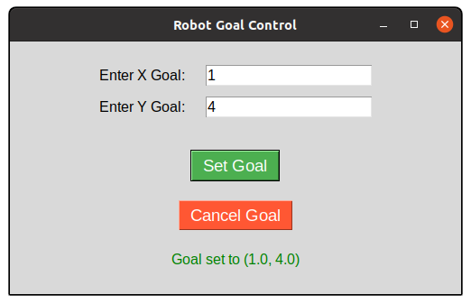

# Assignment 2 - Research Track I

## Project Overview
This ROS package, `assignment2_rt`, was developed as part of Assignment 2 for the *Research Track I* course. The package includes two Python nodes (`service_node` and `action_client`), a custom message (`RobotState.msg`), and a custom service (`LastTarget.srv`). These nodes work together to handle service requests and action goals for a robot in a simulated environment.

- **Service Node (`service_node`)**: Provides a service to retrieve the last target coordinates.
- **Action Client Node (`action_client`)**: Sends goals to an action server and publishes the last target coordinates. It also publishes the custom message `RobotState`, which includes the robot's state (position and velocity) based on the values published on the `/odom` topic.
- **Custom Message (`RobotState.msg`)**: Defines the robot's state including position and velocity.
- **Custom Service (`LastTarget.srv`)**: Defines a service to get the last target coordinates.

---

## Nodes Description

### Service Node (`service_node`)
- **Purpose**: Provides a service to retrieve the last target coordinates set by the action client.
- **Features**:
  - Subscribes to the `/last_target` topic to update the last target coordinates.
  - Provides a service (`get_last_target`) to return the last target coordinates.
- **Execution**: Implemented in Python (`service_node.py`).
- **Launch**: Automatically launched using the provided launch file.

### Action Client Node (`action_client`)
- **Purpose**: Allows the user to set or cancel a target (x, y) and monitors the action server's feedback/status to determine when the target has been reached. It also publishes the robot's position and velocity.
- **Features**:
    - Subscribes to the `/odom` topic to update the robot's position and velocity.
    - Publishes the robot's state to the `/robot_state` topic.
    - Publishes the last target coordinates to the `/last_target` topic whenever a new goal is set.
    - Sends goals to the action server and monitors feedback/status to determine when the target has been reached.
    - Allows the user to cancel the current goal.
- **Execution**: Implemented in Python (`action_client.py`).
- **Launch**: Automatically launched using the provided launch file.

The `action_client` node includes a graphical user interface (GUI) for setting and canceling goals. Below is a screenshot of the GUI:



---

## Custom Message (`RobotState.msg`)
To publish the robot's state, a custom message (`RobotState.msg`) was created.

### Message Definition
```plaintext
float64 x       # Robot's x-coordinate
float64 y       # Robot's y-coordinate
float64 vel_x   # Robot's linear velocity
float64 vel_z   # Robot's angular velocity
```

---

## Custom Service (`LastTarget.srv`)
To retrieve the last target coordinates, a custom service (`LastTarget.srv`) was created.

### Service Definition
```plaintext
# Request (no input needed)
---
# Response (x, y coordinates of the last target)
float64 x
float64 y
```

---

## Installation and Setup
1. **Install ROS Dependencies**:
   Ensure you have the necessary ROS dependencies installed.

2. **Clone the Repositories**:
   ```bash
   mkdir -p ~/catkin_ws/src
   cd ~/catkin_ws/src
   git clone https://github.com/mohamedeyaad/assignment2_rt
   git clone https://github.com/CarmineD8/assignment_2_2024
   cd ~/catkin_ws
   catkin_make
   ```

3. **Source the Workspace**:
   ```bash
   source ~/catkin_ws/devel/setup.bash
   ```

---

## Running the Project

### Launching the Nodes
To launch the `service_node` and `action_client` nodes along with the simulation, use the following command:
```bash
roslaunch assignment2_rt demo.launch
```

### Calling the Service
To call the service and retrieve the last target coordinates, use the following command:
```bash
rosservice call /get_last_target
```

---

## Repository Structure
```
assignment2_rt/
├── launch/
│   └── demo.launch               # Launch file to start the whole simulation
├── msg/
│   └── RobotState.msg            # Custom message definition
├── scripts/
│   ├── service_node.py           # Service node (Python)
│   ├── action_client.py          # Action client node (Python)
├── srv/
│   └── LastTarget.srv            # Service definition
├── images/
│   └── action_client_gui.png     # GUI screenshot
├── CMakeLists.txt
├── package.xml
└── README.md
```